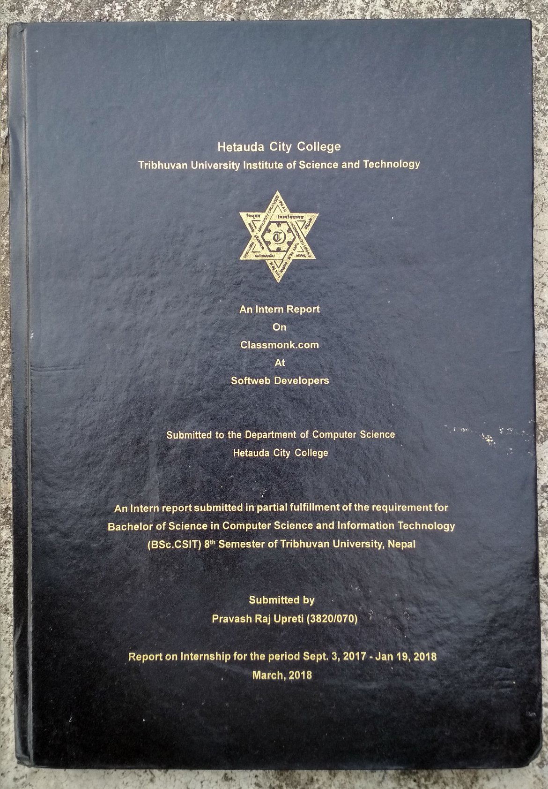
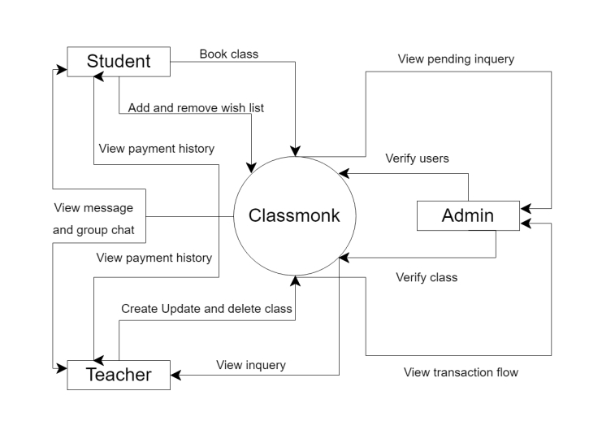
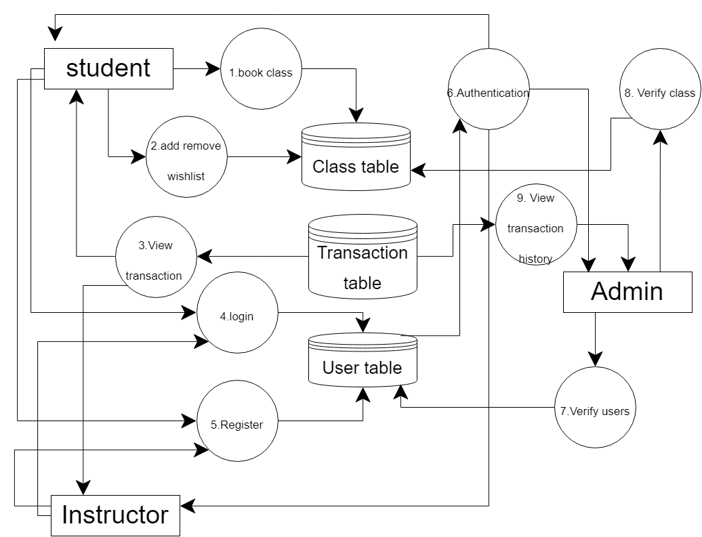
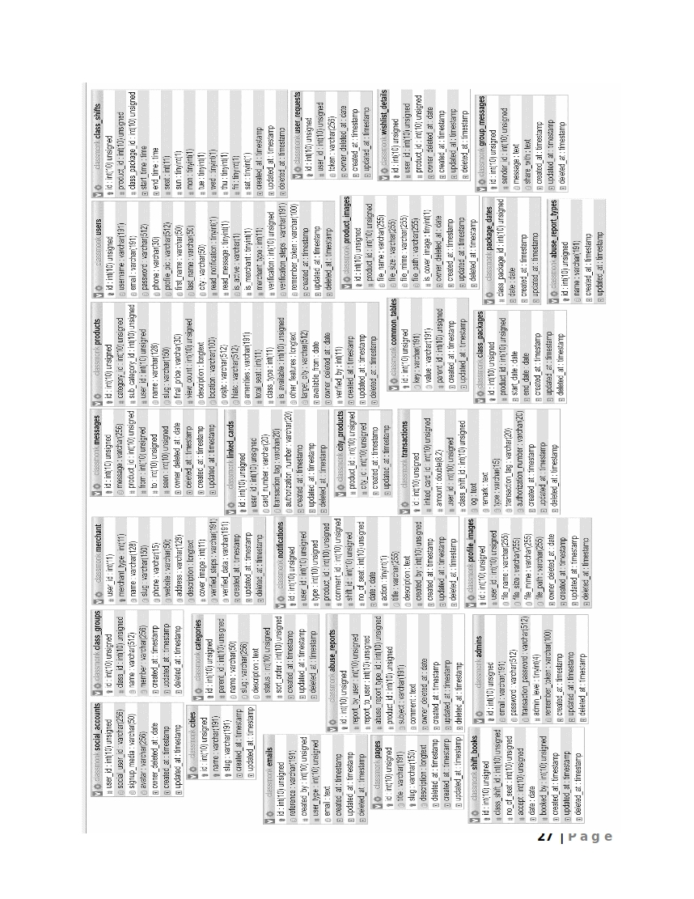
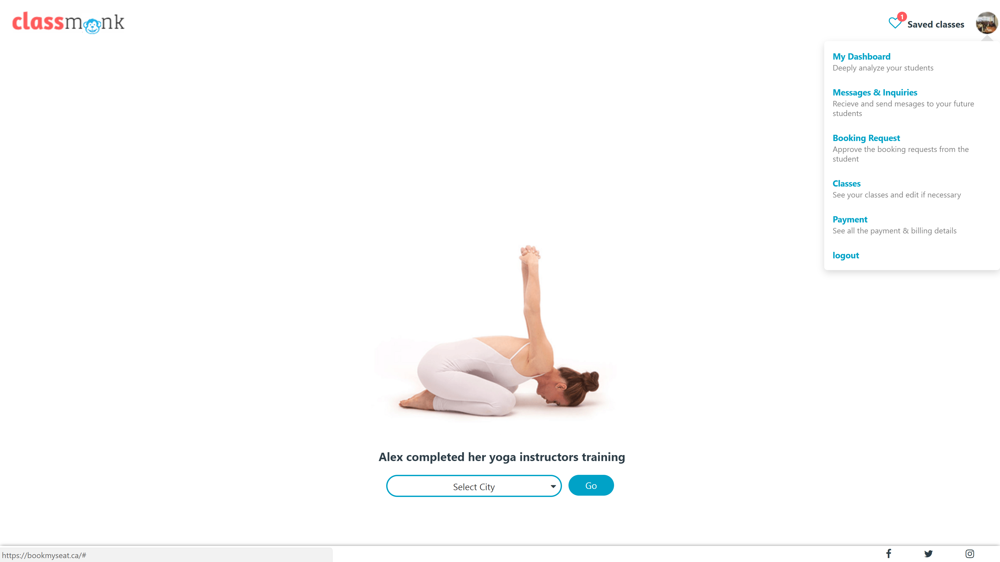
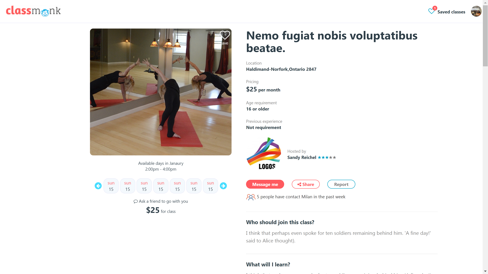
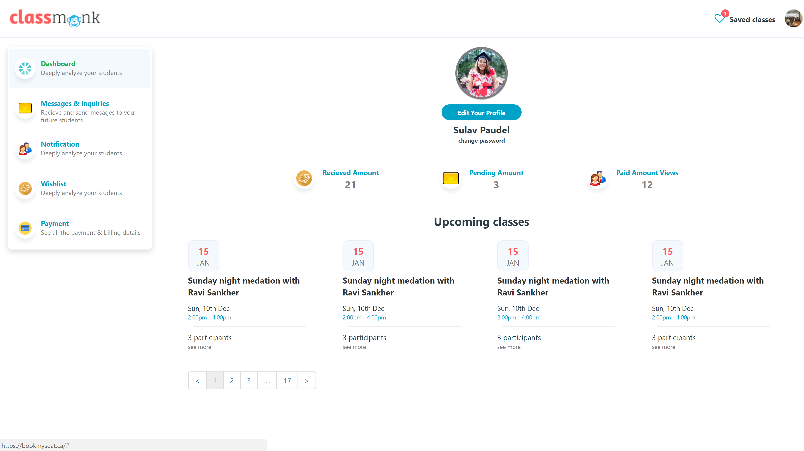
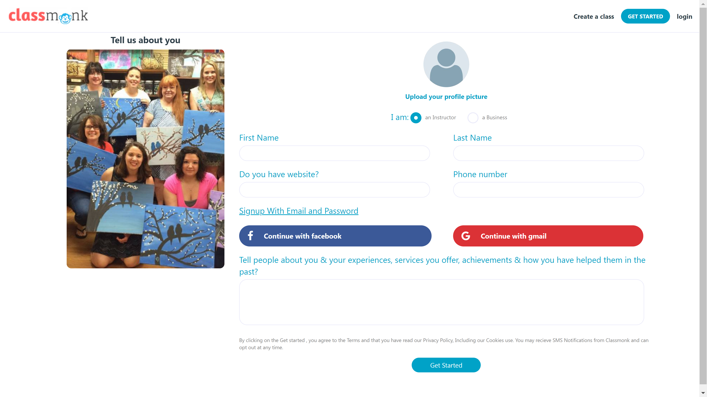

**HETAUDA CITY COLLEGE**

**Tribhuvan University**  **Institute of**  **Science** **and**  **Technology**

**AN**  **INTERN**  **REPORT**

  

**ON**

**Classmonk.com**

**AT**

**Softweb Developers**

  

**Submitted**  **to** **Department** **of**  **Computer**  **Science**  **Hetauda**  **City**  **College**

  

An  Intern  report  submitted  in  partial  fulfillment  of  the  requirement  for  **Bachelor**  **of**  **Science**  **in**  **Computer**  **Science**  **and**  **Information**  **Technology**  **(BSc.**  **CSIT)**  **8****th**  **Semester**  of  Tribhuvan  University,  Nepal

**Submitted**  **by**

Pravash Raj Upreti  (3820/070)

  

Report  of  Internship  for  the  period  September  3,  2017  –  January  19,  2018

  

September,  2017

**MENTOR’S RECOMMENDATION**

Author hereby recommend that this report prepared under my mentorship by **Mr. Pravash Raj Upreti** in partial fulfillment of the requirements for the degree of B.Sc in Computer Science and Information Technology of Tribhuvan University be processed for evaluation.

  
  

…………………………

**Mr. Prayas Sapakota**

Softweb Developers

Hetauda, Nepal

  
  

**SUPERVISOR’S RECOMMENDATION**

Author hereby recommend that this report prepared under my supervision by **Mr. Pravash Raj Upreti** in partial fulfillment of the requirements for the degree of B.Sc in Computer Science and Information Technology of Tribhuvan University be processed for evaluation.

  
  

…………………………

**Er. Sulav Paudel**

Softweb Developers

Hetauda, Nepal

(Project Supervisor)

  
  

**LETTER OF APPROVAL**

This is to certify that this internship report prepared by **Mr. Pravash Raj Upreti** in partial fulfillment of the requirements for the degree of B.Sc in Computer Science and Information Technology of Tribhuvan University be processed for evaluation.

**Mr. Saroj Poudel**

Hetauda City College

(Program Coordinator)

  

**Er. Sulav Paudel**

Hetauda City College

(Intern supervisor)

**Mr. Madhu Kumar Singh**

Hetauda City College

(Lecturer)

  

**Mr. Bal Krishna Subedi**

Tribhuvan University

(The External Examiner)

  
 
  

ACKNOWLEDGMENTS
===============

The successful completion of this internship report would not have been possible without the support and assistance of many individuals and organizations. Author feel immensely blessed to have gotten this during the course of my internship program. Author would like to take this opportunity to offer my earnest admiration to each and every one of them.

All thanks to my adorable parents for their profound help and support during the cause of this project work.

Author express my sentiment of gratitude to Mr. Prayas sir, who has been a continuous source of inspiration as my intern mentor. Without his constant guidance and suggestions, this report would have been nowhere near completion. My gratitude for his trust and generosity goes beyond words. Author indebted and thankful to my learned and revered supervisor for his upbeat personality, kindness; encouraging support and willingness to help have tangibly and greatly improve the quality of my Internship Report and brought up to its present status. Author owe my deepest gratitude to the authors whose work Author have used in this report as Author had to depend on different national and international publications for the completion of the internship report.

Thanks to our colleagues who helped us directly or indirectly to accomplish our work. We are especially grateful to Mr. Saroj Poudel (Coordinator of Hetauda City College), has also been a positive and encouraging influence on our research efforts.

Finally, we thank to all our teachers and colleagues, who were the people, who prepared us for this endeavor. We own you all our success.

  
  

ABSTRACT
========

The internship report highlights the major works carried out by the author in terms of academic and non-academic perspectives. The scope of this document is to identify and describe the analysis carried out, projects completed, experience gained and focuses on the achievements as an intern.

The quest to make life easier and processing faster has led to computerization of various processes. Computer technology has transformed so many sectors especially the Educational sector in no small measure.

In an effort to foster technology driven education, www.classmonk.com has been develop to make a common platform for instructor and students for utilizing their leisure time to share knowledge and increase knowledge. The author was sent to Softweb Developers Ltd to complete his internship. The author found him rather lucky by getting the chance to work in such an environment that Softweb Developers provided and got introduced to some of the new terms, new technologies and new Languages.

The projects that the author worked in certainly helped him by increasing his practical knowledge depth. The research and development projects were particularly helpful in widening his views regarding different web application development frameworks.

  
  

TABLE OF CONTENTS
=================

[ACKNOWLEDGMENTS 5](#_Toc508281446)

[EXECUTIVE SUMMARY 6](#_Toc508281447)

[LIST OF FIGURE 11](#_Toc508281448)

[LIST OF TABLE 12](#_Toc508281449)

[LIST OF ABBREVIATION 13](#_Toc508281450)

[CHAPTER 1: INTRODUCTION 1](#_Toc508281451)

[1.1 BACKGROUND 1](#_Toc508281452)

[1.2 PURPOSE OF INTERNSHIP 2](#_Toc508281453)

[1.3 OBJECTIVE OF INTERNSHIP 2](#_Toc508281454)

[1.4 SCOPE OF THE INTERNSHIP REPORT 2](#_Toc508281455)

[1.5 PROBLEM DEFINITION](#_Toc508281456) [3](#_Toc508281456)

[1.6 LIMITATION OF THE REPORT 4](#_Toc508281457)

[1.7 SELECTION OF ORGANIZATION AND DURATION 4](#_Toc508281458)

[1.8 SOURCE OF DATA COLLECTION](#_Toc508281459) [4](#_Toc508281459)

[1.8.1 PRIMARY SOURCE](#_Toc508281460) [4](#_Toc508281460)

[1.8.2 SECONDARY SOURCES](#_Toc508281461) [5](#_Toc508281461)

[CHAPTER 2: COMPANY OVERVIEW 6](#_Toc508281462)

[2.1 INTRODUCTION 6](#_Toc508281463)

[2.2 ABOUT SOFTWEB DEVELOPERS 6](#_Toc508281464)

[2.3. ORGANIZATION RATIONAL 7](#_Toc508281465)

[2.4 CONTACT DETAILS 7](#_Toc508281466)

[2.5 SERVICES 8](#_Toc508281467)

[2.6 TECHNOLOGY USED 8](#_Toc508281468)

[2.7 FACILITIES FOR EMPLOYEE 9](#_Toc508281469)

[CHAPTER 3: ANALYSIS OF ACTIVITY DONE 10](#_Toc508281470)

[3.1 ORGANIZATION SELECTION 10](#_Toc508281471)

[3.2 DURATION 10](#_Toc508281472)

[3.3 ROLES AND RESPONSIBILITY 11](#_Toc508281473)

[3.4 Classmonk (Overview) 11](#_Toc508281474)

[3.5 TEAM 12](#_Toc508281475)

[3.6 TECHNOLOGIES 12](#_Toc508281476)

[3.7 SCOPE AND DEVELOPMENT APPROACH 13](#_Toc508281477)

[3.8 WEEKLY TIMETABLE 13](#_Toc508281478)

[3.9 TIME LINE 14](#_Toc508281479)

[CHAPTER 4: SYSTEM ANALYSIS 15](#_Toc508281480)

[4.0 REQUIREMENT 15](#_Toc508281481)

[4.1 SOFTWARE CONFIGURATION 15](#_Toc508281482)

[4.2 SOFTWARE TOOLS USED 15](#_Toc508281483)

[4.2.1 FRONT END: 15](#_Toc508281484)

[4.2.2 BACK END 17](#_Toc508281485)

[4.3 HARDWARE CONFIGURATION 18](#_Toc508281486)

[4.4 DATA REQUIREMENT 18](#_Toc508281487)

[4.5 EXTERNAL INTERFACE REQUIREMENT 18](#_Toc508281488)

[4.5.1 GRAPHICAL USER INTERFACE (GUI) 18](#_Toc508281489)

[4.5.2 NON- FUNCTIONAL REQUIREMENT 19](#_Toc508281490)

[4.6 FEASIBILITY STUDY 19](#_Toc508281491)

[4.6.1 TECHNICAL FEASIBILITY 19](#_Toc508281492)

[4.6.2 ECONOMICAL FEASIBILITY 19](#_Toc508281493)

[4.7 MODELLING SYSTEM 20](#_Toc508281494)

[4.7.1 USE CASE DIAGRAM 20](#_Toc508281495)

[CHAPTER 5: SYSTEM DESIGN 21](#_Toc508281496)

[5.1 OVERVIEW 21](#_Toc508281497)

[5.2 SYSTEM ARCHITECTURE 21](#_Toc508281498)

[5.3 CONTEXT FLOW DAIGRAM 22](#_Toc508281499)

[5.4 DATA FLOW DIAGRAM 23](#_Toc508281500)

[5.5 DATABASE DESIGN 23](#_Toc508281501)

[5.6 DATABASE SCHEMA 24](#_Toc508281502)

[5.7 USER INTERFACE DESIGN 26](#_Toc508281503)

[5.7.1 HOME PAGE 27](#_Toc508281504)

[5.7.2 CLASS LIST PAGE 28](#_Toc508281505)

[5.7.3 CLASS DETAIL PAGE 29](#_Toc508281506)

[5.7.4 DASHBOARD 30](#_Toc508281507)

[5.7.3 REGISTER PAGE 31](#_Toc508281508)

[CHAPTER 6: SYSTEM IMPLEMENTATION 32](#_Toc508281509)

[6.1 BACKGROUD 32](#_Toc508281510)

[6.2 HARDWARE SUPPORT 32](#_Toc508281511)

[6.3 SOFTWARE SUPPORT 32](#_Toc508281512)

[6.4 DOCUMENTATION OF THE SYSTEM 33](#_Toc508281513)

[6.4.1 PROGRAM DOCUMENTAION 33](#_Toc508281514)

[6.4.2 PRODUCER DESIGN 33](#_Toc508281515)

[6.5 TESTING STRATEGIES 34](#_Toc508281516)

[6.5.1 BLACK BOX TESTING 34](#_Toc508281517)

[6.5.2 WHITE BOX TESTING 34](#_Toc508281518)

[6.5.3 SYSTEM TESTING 34](#_Toc508281519)

[6.5.4 FUNCTIONAL TESTING 35](#_Toc508281520)

[6.5.5 ALPHA TESTING 35](#_Toc508281521)

[6.5.6 BETA TESTING 35](#_Toc508281522)

[CHAPTER 7: CONCLUSION AND FUTURE ENHANCEMENT 36](#_Toc508281523)

[7.1 CONCLUSION 36](#_Toc508281524)

[7.2 RECOMMENDATION 36](#_Toc508281525)

[7.3 FUTURE ENHANCEMENT 36](#_Toc508281526)

LIST OF ABBREVIATION
====================

  

**S.N**

**ABBREVIATION**

**FULL FORM**

1

SPA

Single Page Application

2

IT

Information Technology

3

ICT

Information and Communication Technology

4

E-Business

Electronic Business

5

SEO

Search Engine Optimization

6

AJAX

Asynchronous JavaScript And XML

7

JSON

JavaScript Object Notation

8

JQuery

JavaScript Query

9

CSS

Cascading Style Sheets

10

HTML

Hypertext Markup Language

11

UI

User Interface

12

DB

Database

13

OS

Operating System

14

API

Application Programming Interface

15

CMS

Content Management System

16

CSIT

Computer Science Information Technology

17

PHP

Hypertext Preprocessor

18

SDLC

Systems development life cycle

19

DFD

Data Flow Diagram

20

SQL

Structured Query Language

21

XHTML

Extensible Hypertext Markup Language

22

XML

eXtensible Markup Language

23

SVG

_Scalable Vector Graphics_;

24

XUL

XML User Interface Language

25

MVC

Model View Controller

26

HMVC

Hierarchical Model View Controller

27

RDBMS

Relational Database Management System

28

XAMP

Cross-Platform (X), Apache (A), MySQL (M), PHP (P) 

CHAPTER 1: INTRODUCTION
=======================

1.1 BACKGROUND
--------------

Internships are formal programs designed to provide practical experience in real world environment to students who are new to field. Internships help to build competent resume by giving students visible work experience Although colleges and universities assists students in finding the right Internship programs, it is the responsibility of the would-be interns to carefully examine internship programs, and see if those programs actually offer the training they need.

There is no standardized duration for how long an Internship program lasts but typically an Internship is the period of three to twelve months. During this period interns have the opportunity to explore their field of interest, find out what future they are diving and whether or not their skill sets match their path of career \[1\].

Internship program provides a distinct platform to interns to build a solid foundation to their career, understand the workplace culture, gain vital work related experience, develop relevant skills, and also presents the opportunity to find permanent employment in the host company.

Some of the major benefits of Internship program to students include:

*   Students can learn about the workplace culture and gain much needed work experience.
    
*   Student can finally experience practical implementation of things they have been learning in the classroom
    
*   Students can build a strong foundation that will bolster their career
    
*   Good performance in the internship program can secure permanent employment with the host company
    
*   Some internship programs are paid programs meaning students can earn money while they get necessary exposure.
    

  
  

1.2 PURPOSE OF INTERNSHIP
-------------------------

Internship program provides a new perspective to the students. It provides learning opportunities outside the boundaries of the course curriculum and classroom activities. These opportunities enhance student’s capability to apply theoretical understanding into real-world scenarios, thereby enhancing the students’ academic and career goals \[2\].

From the student perspective, internship assists with career development in different diverse fields such as coding, programming, networking, marketing, etc. by providing vital work experience that allows students to explore their area of interests and develop relevant skills and competencies.

From the organization perspective, internship provides a unique opportunity to train fresh talents, enhance their professional development as well as aid the professional growth of the intern mentors/supervisor. Organization can also find potential employees within the interns \[3\].

1.3 OBJECTIVE OF INTERNSHIP
---------------------------

The major objectives of internships are:

*   To expose students to a particular job and a profession or industry
    
*   To provide students with opportunity to develop skills in the field of interest
    
*   To assist students in gaining vital work related experience and building strong resume for bright career
    
*   To help students in developing business contacts i.e. creating network contacts
    
*   To help students potentially land permanent or contractual jobs from host company
    

1.4 SCOPE OF THE INTERNSHIP REPORT
----------------------------------

This report is made only for academic purpose and to fulfill the requirement for industrial attachment. This report has covered the direct and indirect aspects of software and website development industry and their challenges.

This report gives an insight of the experience that Author achieved from my workplace. A brief description of Softweb Developers is included so that other students can get to know about the company and may decide whether it is suitable for them or not. If internships are about gathering skills then projects are the main way of gathering them. Till writing this report Author have completed first phase and helped in developing the classmonk.com website. The tasks, timeline and results of those specific projects are included for a better visualization of industry standard projects.

1.5 PROBLEM DEFINITION
----------------------

People in developed country are always willing to utilize their leisure time. An experience people can play the role of instructor and can give some of their time to teach other and earn some money. There are many social platform but none of them are made with focus on part time education system. There are many platform with less trust value and payment system. Instructor can’t trust on the student because current existence platform does not takes responsibilities of that issue. Due to lack of trusted platform student are instructor refuse to depend on online platform and instead they setup their own site and run business. This types of culture increase the cost for student and instructor need huge setup. And this is not a utilizing part time but starting a business. Many instructor with less time are unable to utilize their time and there is no platform for such.

In addition due to the cumbersome, classmonk.com will solve these problems. Each of the manual procedure will be analyzed.

*   Classmonk implements online which make efficient to use using thin client browser
    
*   The instructor will get payment timely and only get trusted students. And Student are also safe from fraud instructor and money back if encounter with fraud
    
*   The credit card is initially linked and always have reserve balance for fraud users
    
*   Each and every behavior is monitor by the system and alert the admin if any things goes wrong
    

1.6 LIMITATION OF THE REPORT
----------------------------

While gathering information, analyzing and representing them Author have faced some limitations. However, despite the limitations author have tried hard to prepare a comprehensive and rather interesting report. The overall limitations of the report are mentioned below:

*   There were some restrictions in disclosing some information as it was assumed to be confidential. Therefore author could not include those in my report.
    
*   Some of the information that author got from secondary sources were not arranged consistently.
    
*   AS the project was built from starch, author could not see the disadvantages of the old system.
    
*   Because of organizational confidentiality, author could not put or disclose some information in the report
    

1.7 SELECTION OF ORGANIZATION AND DURATION
------------------------------------------

The selection of organization is twofold. The first is the student’s area of interest and second is the willingness of the host company to take the student as an intern. As a student is search of a host company for internship program, students are required to prepare a competent resume and perform well in the ‘interview’ and/or ‘assessment’.

1.8 SOURCE OF DATA COLLECTION
-----------------------------

In order to make the report as perfect as possible author here used data collection procedures which articulate the way that author have followed in my report. For this report, information has been gathered from both primary and secondary sources.

### 1.8.1 PRIMARY SOURCE

For primary data, several face-to-face interviews have been conducted with officials from different departments of Softweb Developers.  Information provided by them has been very important for this report .Author conducted with the following professionals:

*   Collect information from different employee asking them
    
*   Different documents available from the portal of Softweb Developers.
    
*   Content provided from Softweb Developers website
    
*   Different employees of Softweb Developers.
    
*   From the company’s Handbook
    

### 1.8.2 SECONDARY SOURCES

To understand different software methodology, software quality assurance, and many other data have been gathered from the internet and different articles and the sources have been given in the references part. The secondary sources of data collection for the report includes-

*   Different websites which defines globally accepted standards
    
*   Different websites which keeps track of achievements of international companies
    
*   Reference Books
    
*   Follow some other internship report to prepare standard on
    

  
  

CHAPTER 2: COMPANY OVERVIEW
===========================

2.1 INTRODUCTION
----------------

Nepal is making quick progress in software and website development industry. There are many mentionable software and website development organizations in Nepal who has contributed significantly to the rise of software and website development industry sector in Nepal and Softweb Developers Ltd. is one of them. This exceptional team has every solution to their clients' biggest and most complicated problems. This organization services are offered both on and offshore, and delivered with pride and passion. This organization is a group of young, motivated, skilled people whose main goal is to provide their clients with an innovative solution regarding web development and software development.

Softweb Developers Ltd company is led by a strong management team and knowledgeable computer engineers and IT knowledge workers with experience in various areas of the information and communication technology (ICT) industry covering software development, wired & wireless solutions, network design and implementation, e-Business applications solutions and others internet related systems.

Softweb Developers Ltd has combined a set of products and services that meet the immediate information technology needs of a small business: Basic and enhanced hosting services, Web design, software development and Intranet applications. With the experience, Softweb Developers Ltd is able to help its customers to define and implement their e-business strategies successfully.

This organization is driven towards providing the best of the technology era through solutions locally and globally with a slogan …..

2.2 ABOUT SOFTWEB DEVELOPERS
----------------------------

Softweb Developers Ltd is premier software and websites development organization established on 2072 which is situated at Hetauda, Makawanpur. This organization is driven towards providing the best of the technology era through solutions locally.

Softweb Developers Ltd is an ever-growing community of passionate and brilliant people. This exceptional team has every solution to their clients' biggest and most complicated problems. This organization services are offered both on and offshore, and delivered with pride and passion. This organization is a group of young, motivated, skilled people whose main goal is to provide their clients with an innovative solution regarding web development and software development.

2.3. ORGANIZATION RATIONAL
--------------------------

Softweb Developers Ltd acquires confident and professionally motivated team to deliver solutions to your needs. They simplify, standardize and automate the organizations technically. Analyzing client need, effective planning, development and maintenance are the major steps for any new web development and software development service they provide. They believe in creating the best technology and product through the combination of best people and best equipment. Everything they do reflects this mission and the values that make it possible. Their Values: Honesty, Trust, Freedom, Innovation, Integrity, Team spirit and Fun are some values influence the way we meet client needs.

2.4 CONTACT DETAILS
-------------------

Organization: Softweb Developers

Address: Hetauda, Nepal

Email: info@softwebdevelopers.com

Phone: +9779851198411, +9779806859377

Official Logo:

Figure: Official Logo

2.5 SERVICES
------------

In today’s world, every organization depends heavily on technology to keep operations connected, drive revenue and support ever growing customer demands. Undoubtedly, Information Technology (IT) is the key to manage technology and it spans wide of areas that include but are not limited to things such as computer software, information systems, programming languages, database management systems, networking etc. keeping these in minds Softweb Developers provides an impressive tally of services and solution. Softweb Developer provides the following services:

*   Ideation, Graphics and Interaction Design :
    
*   Software Development: Softweb Developers provides a flexible and scalable solutions of software (web based or desktop based) to meet our needs for small or large firm.
    
*   Website Development: It provides a professional website design and Development Company with complete solution for all kinds of business along with best web hosting services.
    
*   Business Intelligence: BI programs can also incorporate forms of advanced analytics, such as data mining, predictive analytics, text mining, statistical analysis and big data analysis
    
*   Web Hosting: It provides an enhanced range of web hosting solution that is secure, reliable and according to your business needs.
    
*   SEO Services: It makes every possible effort so that your website actually gets noticed and you receive just the right kind of traffic.
    
*   Domain Registration: It provides the registration of domain name and provides great customer service, the best pricing along with a host of other features.
    

2.6 TECHNOLOGY USED
-------------------

*   Web Application Technologies : AJAX, JavaScript, JSON, JQuery, CSS3, HTML5
    
*   UI Frameworks :Twitter Bootstrap, Angular
    
*   Frameworks : Angular , Laravel , CI
    
*   DB
    
*   Operating System : Linux, Windows, OS X
    
*   Other: Facebook API, Google Map API, CMS, Google API’s
    

2.7 FACILITIES FOR EMPLOYEE
---------------------------

According to two factors of job satisfaction, salary is just a hygiene factor. Motivation factors are important for high productivity. Softweb Developers provides several facilities for the employees. Softweb Developers is like one big family. All the current and ex-employees are members of this Softweb Developers family. Work is fun here. Employees consider the company to be their responsibility. The employees are provided by lunch from the office. Softweb Developers has different ways for recreation of employee.

  
  

**CHAPTER 3: ANALYSIS OF ACTIVITY DONE**

3.1 ORGANIZATION SELECTION
--------------------------

It is very important to select organization that fulfills our objectives. As it is for our internship, it is necessary to select organization where there is learning environment because as an intern our first motive is to learn how the works are carried out in the real field.

The four-year degree of BSc. CSIT allows us to attain knowledge on various aspects of Information Technology. At the same time the internship is the one of the major highlight of the program to expose the students to the professional world. Among the various criteria and sectors provided to us in internship prerequisite statement, software Development Company was chosen. Various organizations were shortlisted and approached out of which the organization with the best lucrative offer and environment was selected.

Softweb Developers Ltd. which is located Hetauda, Makawanpur an IT company that covers software development, wired & wireless solutions, network design and implementation, e-Business applications solutions and others internet related systems and author got selected there. The company helped me gain wide experience by getting me involved in their projects.

3.2 DURATION
------------

  

Start Date

September 3, 2017

Duration

16 weeks

Position

Intern Programmer

Supervisors

Mr. Prayas Sir

Office Hour

10:00 am – 5:30 pm

End Date

January 3, 2018

Table: Internship Duration

3.3 ROLES AND RESPONSIBILITY
----------------------------

During the internship period knowledge of various platforms and programming languages are gained. The target was to deliver a fully-fledged web based system by using different tools and frameworks such as PHP (Laravel) and JS (Angular).

Hence, to meet that objective, this internship required the extensive preliminary studies about the core PHP before actually analyzing the actual requirement of the system. The study was required not only to understand the subject under study but also to realize the solutions to the existing problems and implementing the findings from the study was another bigger challenge. Besides study of, Core PHP other major activities carried out during internship was extensive study of current online platform, presentations of study analysis and practical implementations, and most importantly the team discussions to analyze the customer change request. The regular meetings with the Supervisor and discussion with mentors helped me to wide my horizon of knowledge of the existing system and problem background. Software development is one of the major services of the Softweb Developers Company. Softweb Developers provides a flexible and scalable solutions of software (web based or desktop based) to meet our needs for small or large firm.

Software development is the collective processes involved in creating software programs, embodying all the stages throughout the systems development life cycle ([SDLC](http://searchsoftwarequality.techtarget.com/definition/systems-development-life-cycle)). During my internship, Author worked on Classmonk project which was based on PHP (Laravel) and JavaScript (Angular) frame work.

3.4 Classmonk (Overview)
------------------------

Classmonk is an online platform which helps instructor and student to utilizing their leisure time by sharing knowledge and learning new things. The main hierarchy start from city name. Each city is added by admin where they want to give the services.

There are mainly two types of users first one is normal user / Student who do simple signup using email/password or social signup and second one is instructor account. And instructor account is also categorized in normal instructor and business account. Business account is for enterprise level who want to do run institute.

Student or any user can visit any city and can find the listed classes. There is flexible search and filter options for better experience in finding class. With the integration of google map on it is much easier to find the location and the distance is auto calculated by the Classmonk. Visitor can enter their home location and the distance is calculated to the instructor location

Wish list features helps visitor to save the class as reminder for latter. Student can send email to their friends to participate on the class. Similar classes are suggested according to the user past surfing behavior. This feature helps to increase user experience and save time.

Dashboard are designed for both student and instructor. Dashboard contain the class list payment history messages and inquiries and many more.

Instructor can create two types of classes. One is package based e.g. driving and second is regular recurring classes e.g. yoga. Instructor have features to set pricing seat time duration etc

3.5 TEAM
--------

Author has been assigned with my senior programmer Sulav Paudel for the project. He gave me introductions so that author could understand the project in short time and also assigned me the problem to be fixed. Without his helpful mentoring, author could not involve with the project successfully

3.6 TECHNOLOGIES
----------------

When author has been told to work on Classmonk, author asked Sulav sir which technologies author need to learn to work this project. He gave me a list of technologies and author learned them.

*   SQL Query
    
*   Angular ( Front end JavaScript framework)
    
*   Web Socket
    
*   PHP (Laravel framework)
    

3.7 SCOPE AND DEVELOPMENT APPROACH
----------------------------------

The scope of the project is to create a classmonk.com website. The reason behind to create a web based application easily customizable, accessible anywhere, accessible for a range devices, increased security etc.

The advance admin panel is created to monitor the users and handle all the admin related task. There is different role to different admin which are handled by the super admin. All the web API are created using Laravel and MYSQL is used as the required database. UML modeling is used to create the basic design and flow of the application and once it is done the actual coding is done. Initially all the required API are created along with the database tables. The required business logic is added to improve the scope of the application and the database connections are established. Few test cases are created and manual testing is used in this project.

Test cases are created in a manner to check all the required field level validations and also database validations. Once the application is created the corresponding test cases are executed against couple of runs and the bugs are resolved if any identified. Once the testing is done, the final product is delivered.

3.8 WEEKLY TIMETABLE
--------------------

  

**Weeks**

**Department**

**Activity**

First(Sep 3rd – Sep 10th)

Programming

Preliminary work, planning, analysis for the project

Second(Sep 10th \- Sep 17th)

Programming

Preparation of project proposal and approval from Supervisor

Third(Sep 17th – Sep24th)

Programming

Research on existing online platforms

Fourth(Sep24th - Oct 1st)

Programming

DFD, ER, Schema Diagram and Database design

Fifth, Sixth, Seventh, Eighth, Ninth( Oct 1th – Nov 8th)

Programming

Component Designing in Angular

Tenth , Eleventh , Twelfth ,Thirteenth (Nov 8th – Dec15th)

Programming

Coding in PHP (Laravel) API development

Fourteen(Dec 29th – Jan 5th)

Programming

Testing (Black box, white box, alpha and beta testing), Deploy to server.

Fifteen(Jan 5th – Jan 12th)

Programming

Implementation and competition of first phase

Sixteen(Jan 12th–Jan 19th)

Programming

Final report writing

  
  

Table: Weekly Timetable

**3.9 TIME LINE**
-----------------

This complete project can be completed in 5 months approximately due to several festival holidays. Following are the key tasks involved in the project and I’m giving the approximate weeks to complete 

*   Critical analysis classmonk.com with research on internet and several meeting with client
    
*   UML modeling of the application and this will take 1 week
    
*   Database design which include design of backend database and tables and this will take 1 week
    
*   Front end design using angular component of all the required forms and this will take 5 weeks
    
*   Developing the business and database logic and this will take 4 weeks
    
*   Development of test cases will take 1 week
    
*   Unit testing is done module level and this will take 1 weeks
    

CHAPTER 4: SYSTEM ANALYSIS
==========================

4.0 REQUIREMENT
---------------

4.1 SOFTWARE CONFIGURATION
--------------------------

This website is developed using a PHP (Laravel framework). Laravel is an open-source software rapid development web framework, for use in building dynamic web sites with PHP.

[**Stable**  **release**](https://www.google.com.np/search?q=codeigniter+stable+release&sa=X&ved=0ahUKEwjhn6qErpDZAhWIvI8KHW8zAnYQ6BMIiQEoADAR)**: **5.5.0 / January 4, 2018

[**Developed**  **by**](https://www.google.com.np/search?q=codeigniter+developed+by&stick=H4sIAAAAAAAAAOPgE-LSz9U3MCpMT8nO0lLJKLfST87PyUlNLsnMz9Mvzk8rKU8sSrVKSS1LzckvSE1RSKoEAM3R9l40AAAA&sa=X&ved=0ahUKEwjhn6qErpDZAhWIvI8KHW8zAnYQ6BMIjAEoADAS)**: **[Taylor](https://www.google.com.np/search?q=BCIT&stick=H4sIAAAAAAAAAOPgE-LSz9U3MCpMT8nOUuIEs3MN0qq0VDLKrfST83NyUpNLMvPz9Ivz00rKE4tSrVJSy1Jz8gtSUxSSKgEz56w9PwAAAA&sa=X&ved=0ahUKEwjhn6qErpDZAhWIvI8KHW8zAnYQmxMIjQEoATAS) Otwell

**Operating System**: Windows 10

**Database**: MS SQL Server (back end)

[**License**](https://www.google.com.np/search?q=codeigniter+license&sa=X&ved=0ahUKEwjhn6qErpDZAhWIvI8KHW8zAnYQ6BMIkAEoADAT)**: **MIT License

[**Initial**  **release**](https://www.google.com.np/search?q=codeigniter+initial+release&sa=X&ved=0ahUKEwjhn6qErpDZAhWIvI8KHW8zAnYQ6BMIkwEoADAU)**: **June 9, 2011

[**Platform**](https://www.google.com.np/search?q=codeigniter+platform&sa=X&ved=0ahUKEwjhn6qErpDZAhWIvI8KHW8zAnYQ6BMIlgEoADAV)**: **PHP 7.0.0+

4.2 SOFTWARE TOOLS USED
-----------------------

The whole Project is divided in two parts the front end and the back end.

### 4.2.1 FRONT END:

The front end is designed using of JavaScript (Angular5), CSS, HTML etc.

#### 4.2.1.1 HTML

HTML or Hyper Text Mark-up Language is the main mark-up language for creating web pages and other information that can be displayed in a web26 browser. HTML is written in the form of HTML elements consisting of tags enclosed in angle brackets (like <html>), within the web page content. The purpose of a web browser is to read HTML \[5\] documents and compose them into visible or audible web pages. It provides a means to create structured documents by denoting structural semantics for text such as headings, paragraphs, lists, links, quotes and other items. It can embed scripts written in languages such as JavaScript which affect the behavior of HTML web pages.

#### 4.2.1.2 CSS

Cascading Style Sheets (CSS) is a style sheet language used for describing the look and formatting of a document written in a mark-up language. While most often used to style web pages and interfaces written in HTML and XHTML, the language can be applied to any kind of XML document, including plain XML, SVG and XUL \[5\]. CSS is a cornerstone specification of the web and almost all web pages use CSS style sheets to describe their presentation.CSS is designed primarily to enable the separation of document content from document presentation, including elements such as the layout, colors, and fonts. This separation can improve content accessibility, provide more flexibility and control in the specification of presentation characteristics, enable multiple pages to share formatting, and reduce complexity and repetition in the structural content (such as by allowing for table less web design).CSS can also allow the same mark-up page to be presented in different styles for different rendering methods, such as on-screen, in print, by voice (when read out by a speech-based browser or screen reader) and on Braille-based, tactile devices. It can also be used to allow the web page to display differently depending on the screen size or device on which it is being viewed.

#### 4.2.1.3 JAVA SCRIPT

JavaScript (JS) is a dynamic computer programming language. It is most commonly used as part of web browsers, whose implementations allow client side scripts to interact with the user, control the browser, communicate asynchronously, and alter the document content that is displayed. It is also being used in server-side programming, game development and the creation of desktop and mobile applications. JavaScript is a prototype-based scripting language with dynamic typing and has first- class functions. Its syntax was influenced by C. JavaScript copies many names and naming conventions from Java, but the two languages are otherwise unrelated and have very different semantics. The key design principles within JavaScript are taken from the self and Scheme programming languages. It is a multi-paradigm language, supporting object-oriented, imperative, and functional programming styles.

#### 4.2.1.4 PHP (Laravel)

Laravel is a MVC framework with bundles, migrations, and Artisan CLI. Laravel offers a robust set of tools and an application architecture that incorporates many of the best features of frameworks like Code Igniter, Yii, ASP.NET MVC, Ruby on Rails, Sinatra, and others.

Laravel is an Open Source framework. It has a very rich set of features which will boost the speed of Web Development. If you familiar with Core PHP and Advanced PHP, Laravel will make your task easier. It will save a lot time if you are planning to develop a website from scratch. Not only that, the website built in Laravel is also secure. It prevents the various attacks that can take place on websites.

### 4.2.2 BACK END

The back end is designed using MySQL which is used to design the databases

#### 4.2.2.1 MYSQL

MySQL ("My S-Q-L", officially, but also called "My Sequel") is (as of July 2013) the world's second most widely used open-source relational database management system (RDBMS). It is named after co-founder Michael Widenius daughter, my. The SQL phrase stands for Structured Query Language. The MySQL development project has made its source code available under the terms of the GNU General Public License, as well as under a variety of proprietary agreements. MySQL was owned and sponsored by a single for- profit firm, the Swedish company MySQL AB, now owned by Oracle Corporation .MySQL is a popular choice of database for use in web applications, and is a central component of the widely used LAMP opens source web application software stack (and other 'AMP' stacks). LAMP is an acronym for "Linux, Apache, MySQL, and Perl/PHP/Python." Free-software-open source projects that require a full-featured database management system often use MySQL. For commercial use, several paid editions are available, and offer additional functionality. Applications which use MySQL databases include: TYPO3, MODx, Joomla, WordPress, phpBB, MyBB, Drupal and other software. MySQL is also used in many high-profile, large-scale websites, including Wikipedia, Google (though not for searches), Facebook, Twitter, Flickr, and YouTube.

4.3 HARDWARE CONFIGURATION
--------------------------

**Processor**: Intel core i7 6th generation

**Hard Disk**: 1TB

**RAM:** 16GB

4.4 DATA REQUIREMENT
--------------------

The inputs consist of the query to the database and the output consists of the solutions for the query. The outputs also include the user receiving the details of their accounts. In this project the inputs will be the queries as fired by the users like create an account, create class, make payment etc. Now the output will be visible when the user requests the server to get details of their account in the form of time, date and which class they added or wish list etc.

4.5 EXTERNAL INTERFACE REQUIREMENT
----------------------------------

### 4.5.1 GRAPHICAL USER INTERFACE (GUI)

The software provides good graphical interface for the user and the administrator can operate on the system, performing the required task such as create, update, viewing, and the details of the classes.

*   It allow to pick the city and view list
    
*   There is search and filter the classes
    
*   User can view location on google map
    
*   User may add and remove from wish list
    
*   On detail page similar classes and ask friend to go with you
    
*   It allow to create class add package and schedule shift
    
*   Login register component for new user or guest
    

### 4.5.2 NON- FUNCTIONAL REQUIREMENT

Following are the non-functional requirements of the application:

**Usability:** The application must be easy to use and work properly for precise recommendation.

**Performance:** The application will perform in terms of valid input provided by users.

**Extensibility:** The application use MS SQL Server for further recommendations. Additional features will be added in near future.

4.6 FEASIBILITY STUDY
---------------------

A feasibility study is a test of system proposal according to its workability impact on the organization, ability to meet user needs and effective use of resources. The objective of the feasibility study is not to solve the problem but to acquire a sense of its scope.

### 4.6.1 TECHNICAL FEASIBILITY

We can strongly say that it is technically feasible, since there will not be much difficulty in getting required resources for the development and maintaining the system as well. All the resources needed for the development of the software as well as the maintenance of the same is available in the organization here we are utilizing the resources which are available already \[6\].

### 4.6.2 ECONOMICAL FEASIBILITY

Development of this application is economically feasible. The organization needed not spend much one for the development of the similar system already available. The only thing is to be done is making an environment for the development with an effective supervision. If we are doing so, we can attain the maximum usability of the corresponding resources. Even after the development the organization will not be in a condition to invest more in the organization. Therefore, the system is economically feasible

4.7 MODELLING SYSTEM
--------------------

A requirements model is a set of these diagrams, each of which focuses on a different aspect of the users' needs. It focuses on the system's external behavior, separately from its internal design.

4.7.1 USE CASE DIAGRAM
----------------------

The use-case diagram is used to show what activities are carried by the user instructor and admin that are involved in the system. In this project, the users use the application and instructor create the class admin control overall application. Different activities are carried out by the user and admin supervised these activities.

Figure: Use case diagram

CHAPTER 5: SYSTEM DESIGN
========================

5.1 OVERVIEW
------------

Classmonk maintain the information of user instructor transaction history and many more activity. The database is normalized to keep large record simple

The overall system design objective is to provide an efficient, modular design that will reduce the system’s complexity, facilitate change and result in an easy implementation. This will be accomplished by designing a strongly cohesion system with minimal coupling. In additional, this document will provide interface design models that are consistent, user friendly, and will provide straightforward transitions through the various system functions

The purpose of design phase is to plan a solution for problem specified by the requirements. System design aims is to identify the modules that should be in the system the specification of these modules and how they interact with each other to produce the desired result. The goal of the design process is to produce a module or representation of a system which can be used later to build that system. The produced model is called design of the system. The most important phase of the software of the system is designing the different modules. The accurate planning and proper interconnections with the modules will give a good output in the implementation part.

5.2 SYSTEM ARCHITECTURE
-----------------------

System architecture is overall representation of the data structures and processes which are involved in in the application. System architecture is a pictorial representation of the application that organizes elements of data and standardizes how they relate to one another and to properties of the real world entities. Figure below show the system architecture of the application.

The phase of the design of computer architecture and software architecture can also be referred to as high-level design. The baseline in selecting the architecture is that it should realize all which typically consists of the list of modules, brief functionality of each module, their interface relationships, dependencies, database tables, architecture diagrams, technology details etc. The integration testing design is carried out in the particular phase. After the requirements have been determined the necessary specifications for the hardware, software and people and data resources and the information products that will satisfy the functional requirement of the proposed system can be determined. The design will serve as a blueprint for the system  before these errors or problems are built into the system.

5.3 CONTEXT FLOW DAIGRAM
------------------------

Figure: Context Diagram

Context Diagram shows the general system architecture of Classmonk. This system has mainly three entity user teacher and admin respectively. Student can add and remove wish list, book a class, view message etc. Teacher/Instructor can view the payment history, create update and delete class, and accept the inquiry. Similarly the admin verify the user and classes and also monitor overall system

5.4 DATA FLOW DIAGRAM
---------------------

Figure: Data Flow Diagram

A data flow diagram (DFD) maps out the flow of information for any process or system. It uses defined symbols like rectangles, circles and arrows, plus short text labels, to show data inputs, outputs, storage points and the routes between each destination. Data flowcharts can range from simple, even hand-drawn process overviews, to in-depth, multi-level DFDs that dig progressively deeper into how the data is handled. Classmonk data flow diagram (DFD) shows how the information on platform needs to flow to meet the needs of teacher students as well as Classmonk admin.

5.5 DATABASE DESIGN
-------------------

Database  design is the process of producing a detailed [data  model](https://en.wikipedia.org/wiki/Data_model) of a [database](https://en.wikipedia.org/wiki/Database). This data model contains all the needed logical and physical design choices and physical storage parameters needed to generate a design in a [data  definition  language](https://en.wikipedia.org/wiki/Data_definition_language), which can then be used to create a database. A fully attributed data model contains detailed attributes for each entity.

5.6 DATABASE SCHEMA
-------------------

A database schema is the skeleton structure that represents the logical view of the entire database. It defines how the data is organized and how the relations among them are associated. It formulates all the constraints that are to be applied on the data.

Figure: Database Schema

A database schema defines its entities and the relationship among them. It contains a descriptive detail of the database, which can be depicted by means of schema diagrams.

5.7 USER INTERFACE DESIGN
-------------------------

User interface design(UI) is the [design](https://en.wikipedia.org/wiki/Design) of [user  interfaces](https://en.wikipedia.org/wiki/User_interface) for [machines](https://en.wikipedia.org/wiki/Machine) and [software](https://en.wikipedia.org/wiki/Software), such as [computers](https://en.wikipedia.org/wiki/Computer), [home  appliances](https://en.wikipedia.org/wiki/Home_appliance), [mobile  devices](https://en.wikipedia.org/wiki/Mobile_device), and other [electronic  devices](https://en.wikipedia.org/wiki/Electronics), with the focus on maximizing [usability](https://en.wikipedia.org/wiki/Usability) and the [user  experience](https://en.wikipedia.org/wiki/User_experience) \[8\]. The goal of user interface design is to make the user's interaction as simple and efficient as possible, in terms of accomplishing user goals ([user\-centered  design](https://en.wikipedia.org/wiki/User-centered_design)).

 

### 5.7.1 HOME PAGE

This is landing page of website. Visitor and select the city and view the class list of the city. If user is authenticated then there will be some authenticated link on the top menu. There will be dropdown if user has logged in else there is login register link

  
  

  
### 5.7.2 CLASS LIST PAGE

This is landing page of website. Visitor and select the city and view the class list of the city. If user is authenticated then there will be some authenticated link on the top menu. There will be dropdown if user has logged in else there is login register link

  
  

  
  
  

### 5.7.3 CLASS DETAIL PAGE

This is class detail page. Visitor can see the class available date. The similar listing is display according to the browsing behavior of the visitor/Student. There is large image viewer which makes ease to view the multiple images by sliding. The time slot can be slide and make book on clicking on the time slot. User can directly message and place inquiry using message me button. The share button make ease to share the listing on social media. If the listing is found fake or the instructor is fraud or any irrelevant listing then they can use report features and send report to admin. Latter on admin to through the reported listing and take the actions

  
  

  
  

  
  

### 5.7.4 DASHBOARD

Dashboard contain all the information like payment history, added classes, past classes, messages inquiries book request and dashboard. Dashboard menu has the upcoming request, information about payment, and edit profile features. Message and inquiries contain messaging and group messaging features. Message is one to one and group message of for one to many. The messaging app is real-time and show the online offline features. Class menu has all active classes and past or deleted classes. Payment history is most important. It shows all the transaction made within the specific time period. User can change the time period and download the excel file of their transaction

  

### 5.7.3 REGISTER PAGE

First step for any visitor to connect with system is by registration. After registration they all access to all of the features. User can use social media signup to register and also change the login options with username and password. The detail information is collected by the Classmonk to increase the trust value of the visitor.

  
CHAPTER 6: SYSTEM IMPLEMENTATION
================================

6.1 BACKGROUD
-------------

Class booking and payment management system was the typical application of information management system. Its development mainly included the establishment and maintenance of database and head application development, for the former requirement to establish data consistency and integrity \[9\]. The integrity required the application function, easy to operate. Based on the above consideration, these systems mainly adopt VB6.0 as the front-end application development tools. SQL Server was applied to back-end database. Windows was the system platform development books management system management system. In addition, Classmonk used the software engineering ideas and methods. Overall listing the structured method for system analysis and design of life, while the prototype system between step and the method of facing object

6.2 HARDWARE SUPPORT
--------------------

The server that is required in the successful completion of this project includes;

*   A system can run on I5 5th generation with.
    
*   A random access memory (RAM) of 4 GB.
    
*   A 1TB SSD for handling the large request
    

6.3 SOFTWARE SUPPORT
--------------------

The software support for the design of the proposed system involves:

*   A windows 10operating system.
    
*   XAMP server.
    
*   My SQL database.
    
*   Internet access as well as anti-virus software which prevents the system from being infected by virus.
    

6.4 DOCUMENTATION OF THE SYSTEM
-------------------------------

### 6.4.1 PROGRAM DOCUMENTAION

In order for the proposed system to be deploy on any cloud system it takes the following way:

*   Install Linux distro
    
*   Install required software like nginx webserver, php7.1 , nodejs ,
    
*   Upload the file to server location
    
*   Host the angular application as public domain
    
*   Host api server with any subdomain
    
*   Host the socket server with any domain
    
*   Browse the site on browser
    
*   Beside these there are many steps like updating package, setting for server environment , blocking the ports and maintaining the security, checking the dependency version, updating the framework and monitoring the server uptime
    

### 6.4.2 PRODUCER DESIGN

This refers to the step by step method of using admin and super admin dashboard. The steps to use the admin section are as follows:

*   There are two types of admin super admin and admin
    
*   Super admin is logged from [www.sadmin.classmonk.com](http://www.sadmin.classmonk.com/) with username and password. OTP is send to mobile number to make login more secure. The transaction password is used when super admin tries to make change on entities like create edit delete.
    
*   S-Admin can create admin and get abstract information of Classmonk.
    
*   Admin are logged in from [www.admin100.classmonk.com](http://www.admin100.classmonk.com/) with username and password. Different admin has different role and they are maintained by the super admin.
    
*   Admin has specific task e.g. verifying class and verifying the users
    

6.5 TESTING STRATEGIES
----------------------

Testing methodologies are the strategies and approaches used to test a particular product to ensure it is fit for purpose. Testing methodologies usually involve testing that the product works in accordance with its specification, has no undesirable side effects when used in ways outside of its design parameters and worst case will fail-safely. We apply different methods that can be used for testing \[11\]. Here are some methods which are briefly described:

### 6.5.1 BLACK BOX TESTING

The technique of testing without having any knowledge of the interior workings of the application is called black-box testing. The tester is oblivious to the system architecture and does not have access to the source code. Typically, while performing a black-box test, a tester will interact with the system's user interface by providing inputs and examining outputs without knowing how and where the inputs are worked upon.

### 6.5.2 WHITE BOX TESTING

White-box testing is the detailed investigation of internal logic and structure of the code. White-box testing is also called glass testing or open-box testing. In order to perform white-box testing on an application, a tester needs to know the internal workings of the code. The tester needs to have a look inside the source code and find out which unit/chunk of the code is behaving inappropriately.

### 6.5.3 SYSTEM TESTING

System testing tests the system as a whole. Once all the components are integrated, the application as a whole is tested rigorously to see that it meets the specified Quality Standards. This type of testing is performed by a specialized testing team.

### **6.5.4 FUNCTIONAL TESTING**

We performed functional testing to verify that a software application performs and functions correctly according to design specifications. During functionality testing we check the core application functions, text input, menu functions and installation and setup on localized machines, etc.

### 6.5.5 ALPHA TESTING

This test is the first stage of testing and will be performed amongst the teams (developer and QA teams). Unit testing, integration testing and system testing when combined together are known as alpha testing. During this phase, the following aspects will be tested in the application:

 Spelling Mistakes  
 Broken Links Cloudy Directions The Application will be tested on machines with the lowest specification to test loading times and any latency problems.

### 6.5.6 BETA TESTING

This test is performed after alpha testing has been successfully performed. In beta testing, a sample of the intended audience tests the application. Beta testing is also known as pre**\-**release testing. Beta test versions of software are ideally distributed to a wide audience on the Web, partly to give the program a "real world" test and partly to provide a preview of the next release.

  
  

CHAPTER 7: CONCLUSION AND FUTURE ENHANCEMENT
============================================

7.1 CONCLUSION
--------------

With the advancement of web and internet, it is becoming so ease for end user to use web based services.

7.2 RECOMMENDATION
------------------

For further research work to be carried out, author hereby suggest the following:

*   Load balancing server
    
*   Proxy server for better security
    
*   Multiple server with copy of app for maximizing the server uptime
    
*   Multiple database server for data replication and using master slave architecture
    

7.3 FUTURE ENHANCEMENT
----------------------

The Classmonk platform in web based and does not takes time to get Hugh traffic. For making the system more stable and face more competition from similar product, it must add unique and killer features to the app.

This is the age of artificial intelligence and machine learning. Visitor does not want to waste their time on searching the classes what they are looking for. We can use AI and Machine learning algorithm to help student to get whatever class they want. It helps on fraud detection on system. There will be many instructor who just came to make money and student can be encounter with those fraud instructor. There can be spam inquiry for classes from student. We are making user to easily register to system which increase the traffic to site but it has several disadvantage. We are not collecting KYC detail of customer. This can lead to serious issue. We can use AI to solve this types of problems

Mobile app is becoming very ease and handy to interact with the online platform. The app for iOS and Android platform is needed for covering wide range of users. App has more feature than website. It get access to the native API and caching on local storage save bandwidth and offline access.

**BIBLIOGRAPHY**

\[1\] SearchSoftwareQuality. (2018). What is Web application (Web app)? - Definition from WhatIs.com. \[online\] Available at: _http://searchsoftwarequality.techtarget.com/definition/Web-application-Web-app \[Accessed 8 Mar. 2018\]._

\[2\] Google Developers. (2018). Progressive Web Apps | Web | Google Developers. \[online\] Available at: _https://developers.google.com/web/progressive-web-apps/ \[Accessed 8 Mar. 2018\]._

\[3\] Forbes.com. (2018). Forbes Welcome. \[online\] Available at: _https://www.forbes.com/sites/forbestechcouncil/2017/04/07/how-to-choose-a-front-end-framework/ \[Accessed 8 Mar. 2018\]._

\[4\] Yuan, C., Li, D. and Li, Y. (2014). Review on Real-Time Communications Technology in Web Application. Advanced Materials Research, 1044-1045, pp.1309-1314.

\[5\] Barabino, G., Concas, G., Corona, E., Grechi, D., Marchesi, M. and Tigano, D. (2015). Web framework points: an effort estimation methodology for Web application development using a content management framework. Journal of Software: Evolution and Process, 27(9), pp.603-624.

\[6\] Bog, A. (2014). Benchmarking transaction and analytical processing systems. Berlin: Springer.

\[7\] Enriquez, R. (2014). RESTful Java Web Services Security. Birmingham: Packt Publishing.